# Phase 1: Problem Definition - Cargo Ship Inventory Sync

## System Overview

```mermaid
flowchart TB
    subgraph SYSTEM["🚢 OFFLINE ASSET SYNC SYSTEM"]
    
        direction TB
        
        subgraph ENTITIES["📦 Entities"]
            E1["Containers"]
            E2["Goods"]
            E3["Documents"]
        end
        
        subgraph USERS["👥 Users"]
            U1["Captain"]
            U2["Cargo Officer"]
            U3["Shore Manager"]
        end
        
        subgraph CONSTRAINTS["⚠️ Constraints"]
            C1["21 days offline"]
            C2["128kbps satellite"]
            C3["$10/MB bandwidth"]
        end
        
        subgraph RISKS["🔴 Risks"]
            R1["$50K customs fines"]
            R2["Cargo seizure"]
            R3["Safety incidents"]
        end
    end
```

---

## Data Model Overview

| Entity | Fields |
|--------|--------|
| **VESSEL** | vessel_id (PK), name, imo_number, current_route, last_sync |
| **CONTAINER** | container_id (PK), vessel_id (FK), iso_size_code, seal_number, status, gps_location, version, updated_at |
| **GOODS** | goods_id (PK), container_id (FK), description, quantity, weight_kg, value_usd, status |
| **DOCUMENT** | doc_id (PK), container_id (FK), doc_type, content, clearance_status |

### Relationships

```mermaid
flowchart LR
    VESSEL["🚢 VESSEL"] --> CONTAINER["📦 CONTAINER"]
    CONTAINER --> GOODS["📋 GOODS"]
    CONTAINER --> DOCUMENT["📄 DOCUMENT"]
    CONTAINER --> STATUS["🔄 STATUS_CHANGE"]
    
    VESSEL -->|"1 : many"| CONTAINER
    CONTAINER -->|"1 : many"| GOODS
    CONTAINER -->|"1 : many"| DOCUMENT
```

---

## User Roles & Permissions

```mermaid
flowchart LR
    subgraph VESSEL["🚢 Vessel Side"]
        CAP["👨‍✈️ Captain"]
        CO["👷 Cargo Officer"]
    end
    
    subgraph SHORE["🏢 Shore Side"]
        SM["👔 Shore Manager"]
        CUSTOMS["📋 Customs Broker"]
    end
    
    subgraph DATA["Data Ownership"]
        PHYS["Physical Status<br/>(loaded, damaged, location)"]
        DOCS["Documentation<br/>(customs, compliance)"]
    end
    
    CAP -->|"✅ Full Authority"| PHYS
    CO -->|"✅ Write Access"| PHYS
    CAP -->|"👁️ Read Only"| DOCS
    
    SM -->|"✅ Full Authority"| DOCS
    CUSTOMS -->|"✅ Write Access"| DOCS
    SM -->|"👁️ Read Only"| PHYS
```

---

## Conflict Resolution Rules

```mermaid
flowchart TD
    CONFLICT["⚔️ Conflict Detected<br/>Same record modified on<br/>vessel AND shore"]
    
    CONFLICT --> CHECK{"What field<br/>was modified?"}
    
    CHECK -->|"Physical Status<br/>(location, damage, loaded)"| VESSEL_WINS["🚢 Vessel Wins<br/>(Captain has eyes on cargo)"]
    CHECK -->|"Customs/Documents<br/>(clearance, compliance)"| SHORE_WINS["🏢 Shore Wins<br/>(Compliance team owns this)"]
    CHECK -->|"Other fields"| STORE_BOTH["📦 Store Both<br/>as siblings"]
    
    VESSEL_WINS --> AUDIT["📝 Store both versions<br/>for audit trail"]
    SHORE_WINS --> AUDIT
    STORE_BOTH --> USER["👤 User chooses<br/>on next access"]
    
    USER --> AUDIT
```

---

## System Constraints

```mermaid
flowchart TB
    subgraph CONNECTIVITY["📡 Connectivity"]
        SAT["Satellite: 128kbps"]
        COST["Cost: $10/MB"]
        WINDOW["Sync Window: Port arrival"]
    end
    
    subgraph SCALE["📊 Scale"]
        FLEET["100 vessels"]
        CONTAINERS["2,000 containers/vessel"]
        CHANGES["500 changes/day/vessel"]
    end
    
    subgraph TIMING["⏱️ Timing"]
        OFFLINE["Offline: Up to 21 days"]
        SYNC["Sync time: < 5 min"]
        DATA["Daily data: 50MB → 1.2MB"]
    end
```

---

## Risk Matrix

| Risk | Impact | Probability | Mitigation |
|------|--------|-------------|------------|
| Lost customs docs | $50K fine + cargo held | Low | Checksums, redundant storage |
| Sync corruption | Data integrity loss | Low | Transaction logs, rollback |
| Container miscount | Operational delays | Medium | Reconciliation checks |
| Network timeout | Sync failure | High | Retry with exponential backoff |

---

## Offline Timeline Scenario

---

## Summary Table

| Parameter | Value |
|-----------|-------|
| **Primary Entity** | Containers with Goods inside |
| **Data Fields** | container_id, type, location, status, docs; goods_id, description, qty, weight, value, status, docs |
| **Conflict Model** | Multi-version storage (siblings) with domain-aware defaults |
| **Connectivity** | Satellite (128kbps, $10/MB) |
| **Offline Duration** | Up to 21 days (transpacific worst case) |
| **Fleet Size** | 100 vessels |
| **Containers per Vessel** | 2,000 average |
| **Records per Day** | ~500 status changes per vessel |
| **Estimated Daily Data** | ~50MB raw → ~1.2MB compressed |
| **Critical Failure** | Lost customs docs = $50K fine + cargo held |

---

## Conflict Resolution Summary

**Rule**: Since captain is on vessel, they have authority on physical status. Shore manager has authority on customs clearance and documents.

**Implementation**: 
1. Store both values as concurrent siblings
2. Apply domain-aware default (vessel wins physical, shore wins docs)
3. User can override and manually choose winner
4. Full audit trail preserved regardless of resolution method
