# Phase 2: Architecture - Cargo Ship Inventory Sync

## System Architecture Overview

```mermaid
flowchart TB
    subgraph VESSEL["🚢 VESSEL SIDE"]
        UI["📱 Tablet UI"]
        APP["⚙️ Sync Engine"]
        SQLITE[("💾 SQLite")]
        QUEUE["📋 Change Queue"]
        
        UI --> APP
        APP --> SQLITE
        APP --> QUEUE
    end
    
    subgraph TRANSPORT["📡 TRANSPORT LAYER"]
        SAT["🛰️ Satellite Link<br/>128kbps, $10/MB"]
        COMPRESS["🗜️ Gzip Compression"]
        RETRY["🔄 Retry Logic"]
    end
    
    subgraph SHORE["🏢 SHORE SIDE"]
        LB["⚖️ Load Balancer"]
        API["🔌 REST API"]
        PG[("🐘 PostgreSQL")]
        RESOLVER["⚔️ Conflict Resolver"]
        DLQ["💀 Dead Letter Queue"]
        
        LB --> API
        API --> PG
        API --> RESOLVER
        RESOLVER --> DLQ
    end
    
    QUEUE --> COMPRESS
    COMPRESS --> SAT
    SAT --> RETRY
    RETRY --> LB
```

---

## Sync Flow: Happy Path

```mermaid
sequenceDiagram
    participant V as 🚢 Vessel
    participant Q as 📋 Queue
    participant S as 🛰️ Satellite
    participant A as 🔌 Shore API
    participant DB as 🐘 PostgreSQL

    Note over V: Offline 14 days<br/>500 changes accumulated
    
    V->>V: Detect connectivity
    V->>Q: Get pending changes (synced=false)
    Q-->>V: Return 500 records
    
    V->>V: Compress with gzip (50MB → 5MB)
    V->>S: POST /sync {changes, last_sync_token}
    S->>A: Forward request
    
    A->>A: Validate vessel auth
    
    loop For each record
        A->>DB: Check version conflict
        alt No conflict
            A->>DB: Apply change
        else Conflict detected
            A->>A: Apply resolution rules
            A->>DB: Store with conflict metadata
        end
    end
    
    A->>DB: Get shore changes for vessel
    DB-->>A: Return 50 new records
    
    A-->>S: Response {accepted, conflicts, server_changes, new_token}
    S-->>V: Forward response
    
    V->>Q: Mark accepted as synced=true
    V->>V: Apply server_changes to SQLite
    V->>V: Show conflicts to user
    
    Note over V: Sync complete ✅
```

---

## Sync Flow: Conflict Resolution

```mermaid
sequenceDiagram
    participant CAP as 👨‍✈️ Captain
    participant V as 🚢 Vessel DB
    participant A as 🔌 Shore API
    participant MGR as 👔 Shore Manager
    participant S as 🏢 Shore DB

    Note over CAP,S: Container C-1234 edited by both sides
    
    CAP->>V: Mark C-1234 as DAMAGED<br/>(version 5)
    MGR->>S: Mark C-1234 as DELIVERED<br/>(version 6)
    
    Note over V,S: Vessel comes online, syncs
    
    V->>A: Push {C-1234, status=DAMAGED, version=5}
    A->>S: Check current version
    S-->>A: Current version = 6, status = DELIVERED
    
    A->>A: CONFLICT DETECTED!<br/>incoming_version (5) < current (6)
    
    alt Physical Status Field
        A->>A: Rule: Vessel wins for physical status
        A->>S: Store {status=DAMAGED, conflict_winner=vessel}
    else Customs/Docs Field  
        A->>A: Rule: Shore wins for customs
        A->>S: Store {status=DELIVERED, conflict_winner=shore}
    end
    
    A->>S: Store both versions for audit
    A-->>V: Response {conflict_resolved, both_values_stored}
    
    Note over V: User can review resolution
```

---

## State Machine: Sync Engine

```mermaid
stateDiagram-v2
    [*] --> IDLE
    
    IDLE --> CHECKING: Connectivity detected
    IDLE --> IDLE: No connection
    
    CHECKING --> IDLE: No pending changes
    CHECKING --> PREPARING: Has changes
    
    PREPARING --> PUSHING: Payload ready
    PREPARING --> FAILED: Compression error
    
    PUSHING --> PROCESSING: Request sent
    PUSHING --> RETRYING: Network timeout
    
    PROCESSING --> RESOLVING: Conflicts found
    PROCESSING --> APPLYING: No conflicts
    
    RESOLVING --> APPLYING: Conflicts resolved
    RESOLVING --> MANUAL: Needs user input
    
    MANUAL --> APPLYING: User resolved
    
    APPLYING --> COMPLETE: All applied
    APPLYING --> FAILED: Apply error
    
    RETRYING --> PUSHING: Retry attempt
    RETRYING --> FAILED: Max retries exceeded
    
    COMPLETE --> IDLE: Reset
    FAILED --> IDLE: Error logged
    
    note right of RETRYING
        Exponential backoff:
        1s → 2s → 4s → 8s → 16s
        Max 5 retries
    end note
```

---

## Component Architecture

---

## Priority Queue System

```mermaid
flowchart TB
    subgraph INCOMING["Incoming Changes"]
        C1["Safety Alert 🚨"]
        C2["Container Status 📦"]
        C3["Inspection Record 📋"]
        C4["System Logs 📝"]
    end
    
    subgraph QUEUES["Priority Queues"]
        Q1["🔴 CRITICAL<br/>Sync immediately"]
        Q2["🟠 HIGH<br/>Sync within 1 hour"]
        Q3["🟡 NORMAL<br/>Sync within 4 hours"]
        Q4["🟢 LOW<br/>Sync when bandwidth cheap"]
    end
    
    C1 --> Q1
    C2 --> Q2
    C3 --> Q3
    C4 --> Q4
    
    Q1 -->|"First"| SEND["📡 Satellite Uplink"]
    Q2 -->|"Second"| SEND
    Q3 -->|"Third"| SEND
    Q4 -->|"Last"| SEND
```

---

## Bandwidth Optimization

| Technique | Before | After | Savings |
|-----------|--------|-------|---------|
| Raw sync | 50 MB | - | - |
| Delta sync only | 50 MB | 10 MB | 80% |
| + Gzip compression | 10 MB | 1.5 MB | 85% |
| + Priority deferral | 1.5 MB | 1.2 MB | 20% |
| **Total** | **50 MB** | **1.2 MB** | **97.6%** |

**Cost**: $500/day → $12/day per vessel

---

## Key Design Decisions

### Decision 1: SQLite over PostgreSQL on Vessel
- **Reason**: Zero-config, file-based, works offline, low resource usage
- **Tradeoff**: No concurrent write scaling, limited query features

### Decision 2: REST over WebSocket  
- **Reason**: Stateless = retry-friendly, survives connection drops, simpler debugging
- **Tradeoff**: No server push, higher latency for real-time updates

### Decision 3: Delta Sync with Sync Tokens
- **Reason**: 97% bandwidth reduction, critical for $10/MB satellite
- **Tradeoff**: Complex change tracking, token management

### Decision 4: Domain-Aware Conflict Resolution
- **Reason**: Physical status → vessel authority, Docs → shore authority
- **Tradeoff**: Rules must be maintained, edge cases need manual review

---

## Failure Points & Mitigations

```mermaid
flowchart TD
    subgraph FAILURES["Failure Points"]
        F1["🔴 Network drops mid-sync"]
        F2["🔴 Corrupt payload"]
        F3["🔴 Version conflict"]
        F4["🔴 Shore server down"]
        F5["🔴 Vessel disk full"]
    end
    
    subgraph MITIGATIONS["Mitigations"]
        M1["Checkpoint + resume"]
        M2["Checksum validation"]
        M3["Conflict resolver"]
        M4["Circuit breaker + retry"]
        M5["Prune old logs"]
    end
    
    F1 --> M1
    F2 --> M2
    F3 --> M3
    F4 --> M4
    F5 --> M5
```

